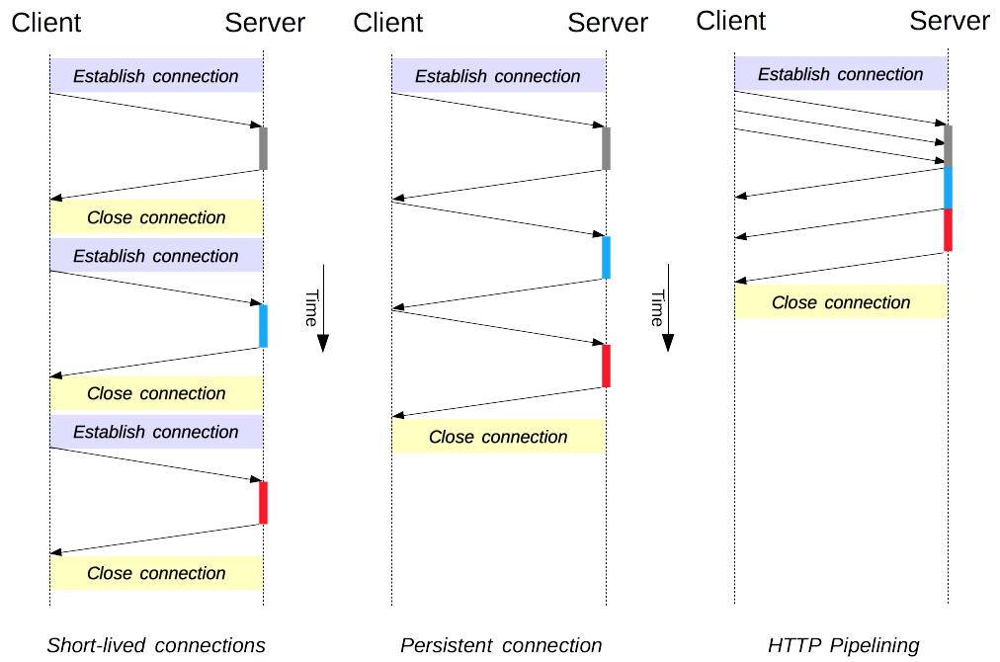
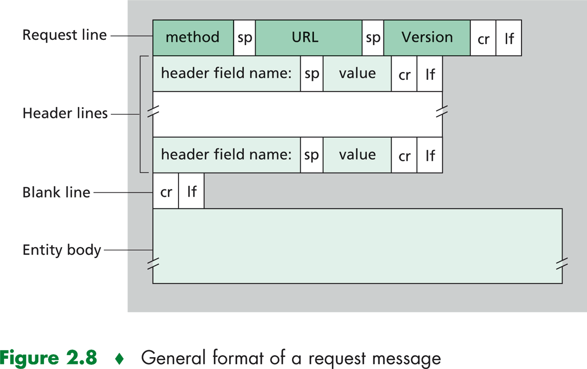
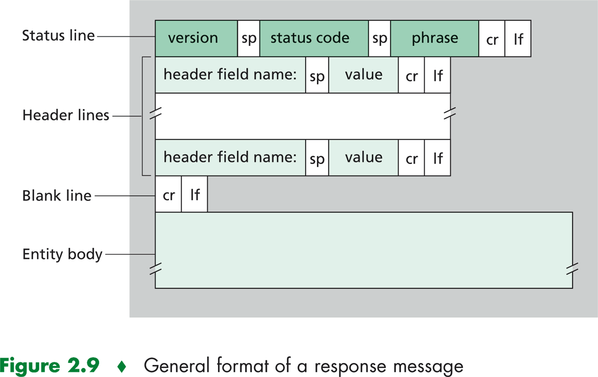

# About HTTP

## 웹과 HTTP

### 웹

1. 월드 와이드 웹(World Wide Web)이란 인터넷에 연결된 사용자들이 서로의 정보를 공유할 수 있는 공간을 의미합니다.
2. 인터넷상의 하나의 서비스
3. 특징중 하나로 멀티미디어 정보를 하이퍼텍스트 방식으로 제공한다는 점이 있다.
( 하이퍼 텍스트 : 문서 내부에 또 다른 문서로 연결되는 참조를 집어 넣음으로써 웹 상에 존재하는 여러 문서끼리 서로 참조할 수 있는 기술) 

### HTTP(HyperText Transfer Protocol)

1. 웹의 어플리케이션 계층 프로토콜 
2. HTTP는 두가지 프로그램으로 구현됨(클라이언트, 서버)
즉 서로 다른 종단 시스템의 각 프로그램들은 HTTP 메시지를 교환하여 통신한다.
HTTP는 메시지의 구조 및 클라이언트와 서버가 어떻게 메시지를 교환할 지(클라이언트가 서버에게 웹 페이지를 어떻게 요청할지 + 서버가 클라이언트에게 어떻게 웹 페이지를 전송할 지)를 정의함.
3. TCP를 전송 프로토콜로 사용함. 즉 클라이언트는 서버와 TCP연결을 진행하고, 연결이 되면 HTTP request 메시지를 소켓 인터페이스로 보냄. 즉, 이러한 계층구조로 인해 HTTP는 데이터 손실 또는 복구 과정등을 몰라도 된다.
4. 서버는 클라이언트에 대한 어떠한 상태정보도 저장하지 않는다. 따라서 HTTP를 비상태 프로토콜(stateless)라고 부르기도 한다.

### 비지속 연결과 지속 연결

**비 지속 연결**

**단기 커넥션 (HTTP/1.0의 기본 커넥션)**

기존 요청마다 TCP커넥션을 새로 하던 모델

- 연결하는것에 자원을 소비하므로 성능상의 제약
- 현대 웹페이지는 한 페이지를 제공하기 위해 많은 요청을 필요로 한다. 따라서 위의 모델은 비 효율적이다.

1. HTTP는 default값으로 지속 연결을 사용한다. 즉 여러 객체를 요청하기위한 url요청/응답 쌍들이 한 tcp연결상에서 전달된다. but, HTTP 클라이언트와 서버는 비지속 연결을 사용하도록 설정할 수 있다.
2. 비지속 연결은 한 객체의 요청마다 다른 TCP연결 과정을 거친다. 비지속 연결에서는 동시성 정도(브라우저의 기본값은 보통 5~10개의 TCP연결을 동시에 설정)가 중요하다.
3. RTT(Round Trip time)은 패킷이 서버로 가서 클라이언트에 되돌아 오는데 걸리는 시간이다.

> 1. 클라이언트는 tcp 메세지를 서버로 보내고, 서버는 tcp메세지로 응답한다.
2. 클라이언트는 HTTP 요청 메세지를 TCP 연결로 보내면서, 핸드셰이크의 세번쨰 부분(응답)을 같이 보낸다.
즉 총 응답 시간은 2 RTT와 HTML파일 하나의 전송시간을 더한 값이다.

**지속 연결**

[HTTP 1.1부터 두가지 커넥션 관리 모델이 추가되었다.](https://developer.mozilla.org/ko/docs/Web/HTTP/Connection_management_in_HTTP_1.x)

**영속적인 커넥션 모델**

연속적인 요청 사이에 커넥션을 유지하여, 새 커넥션을 여는데 필요한 시간을 줄임.

- keep-alive 커넥션이라 불림
- 얼마간 커넥션을 열어놓고, 여러 요청에 재사용함.(서버는 Keep-Alive 헤더를 통해 연결이 유지되야 하는지를 설정 한다.)
- **Keep-Alive :** 일반 헤더는 송신자가 연결에 대한 타임아웃과 요청 최대 개수를 어떻게 정했는지에 대해 알려줍니다.

비고 : HTTP/2는 커넥션 관리의 몇가지 모델을 더 추가합니다.
HTTP내의 커넥션 관리는 [end-to-end가 아닌 hop-by-hop](https://developer.mozilla.org/en-US/docs/Web/HTTP/Headers#hbh)헤더를 사용한다. 즉 클라이언트 - 프록시 사이의 커넥션은, 프록시 - 최종 서버 의 커넥션 모델이 다를 수 있다.
hop-by-hop : 두개의 연속된 노드 사이의 커넥션에 적용되는 헤더(프록시가 이 헤더를 수정하지 않고 그대로 재전송 해야하는 end-to-end헤더와 반대되는 개념)

**HTTP 파이프라이닝**

한 단계 더 나아가, 응답조차 기다리지 않고 연속적인 요청을 보내서 네트워크 지연을 더욱 줄였다.

- 모던 브라우저들에서 기본적으로 활성화 되어있지 않다.
구현복잡성, 미미안 성능향상의 이유로 HTTP/2에서 더나은 알고리즘으로 대체되었다.

더 나은 알고리즘인 멀티플렉싱에 대한 이해

- [[HTTP] HTTP 2의 탄생 배경과 특징](https://americanopeople.tistory.com/115), [SPDY by Google, Speed+Mobility by Microsoft and HTTP 2.0](https://nuli.navercorp.com/sharing/blog/post/1132452)

위 세가지 기술을 비교한 자료

**~~도메인 샤딩~~**

http/2 이전의 성능향상기법. http/2가 도입됨으로써 사용하지 

**~~Domain sharding 은 resource 를 여러 개의 domain 으로 나누어 저장하여, page load time 을 향상시키는 일종의 트릭 혹은 방법이다.~~**

**~~최신 브라우저들은 보통 한 도메인에 약 6개의 동시 다운로드를 제공한다.** 이 갯수를 초과하는 페이지의 경우 초과하는 갯수를 6으로 나눈 도메인에 리소스를 뿌려두면, parallel 하게 리소스들을 다운받을 수 있다.~~

서버가 응답을 보낸후에 TCP연결을 그대로 유지하는 방식

파이프라이닝

최근 HTTP 2부터는 같은 연결상에서 다중 요청과 응답이 가능하고, 이 연결 내에서 HTTP메시지 요청과 응답의 우선순위 기법이 가능하도록 제안됨.

**파이프라이닝** : 컴퓨터구조에서 어떤 명령어가 중첩되어 실행되는 구조
프로세서의 성능을 높이기 위하여, 명령어 처리 과정을 여러 단계로 나누어 단계별로 동시에 수행하여 병렬화 시키는 방법.

### HTTP 메세지 포맷

**HTTP REQUEST 메시지**

**HTTP RESPONSE 메시지**

### HTTP Headers

헤더는 컨텍스트에 따라 분류할 수 있다.

1. [General header](https://developer.mozilla.org/en-US/docs/Glossary/General_header) : request와 response에 둘다 사용되고, **body의 데이터과 연관이 없는 헤더**
ex : Date, Cache-Control, Connection

2. [Entity header](https://developer.mozilla.org/en-US/docs/Glossary/entity_header) : request와 response 양쪽에서 사용되고 **메세지의 body의 내용을 설명하는 헤더**
ex : Content-Length, Content-Language, Content-Encoding

    POST /myform.html HTTP/1.1
    Host: developer.mozilla.org
    User-Agent: Mozilla/5.0 (Macintosh; Intel Mac OS X 10.9; rv:50.0) Gecko/20100101 Firefox/50.0
    Content-Length: 128

3. [Request header](https://developer.mozilla.org/en-US/docs/Glossary/Request_header) : 가져올 데이터에 대한 정보나, resource를 요청하는 클라이언트에 대한 정보에 대한 헤더

- Accept, Accept-, If- 는 제한적인 요청을 할수 있게 한다.
- Cookie, User-Agent, Referer는 맥락을 정해서, 서버가 맥락에 맞는 응답을 할 수 있게 한다.

    GET /home.html HTTP/1.1
    Host: developer.mozilla.org
    User-Agent: Mozilla/5.0 (Macintosh; Intel Mac OS X 10.9; rv:50.0) Gecko/20100101 Firefox/50.0
    Accept: text/html,application/xhtml+xml,application/xml;q=0.9,*/*;q=0.8
    Accept-Language: en-US,en;q=0.5
    Accept-Encoding: gzip, deflate, br
    Referer: https://developer.mozilla.org/testpage.html
    Connection: keep-alive
    Upgrade-Insecure-Requests: 1
    If-Modified-Since: Mon, 18 Jul 2016 02:36:04 GMT
    If-None-Match: "c561c68d0ba92bbeb8b0fff2a9199f722e3a621a"
    Cache-Control: max-age=0

4. Response header : response에 대한 추가 정보(위치나, 소스를 제공한 서버에 대한). **response메세지의 내용과 관련이 없다.**

- Age, Location, Server는 응답의 더 자세한 맥락을 제공한다.

    200 OK
    Access-Control-Allow-Origin: *
    Connection: Keep-Alive
    Content-Encoding: gzip
    Content-Type: text/html; charset=utf-8
    Date: Mon, 18 Jul 2016 16:06:00 GMT
    Etag: "c561c68d0ba92bbeb8b0f612a9199f722e3a621a"
    Keep-Alive: timeout=5, max=997
    Last-Modified: Mon, 18 Jul 2016 02:36:04 GMT
    Server: Apache
    Set-Cookie: mykey=myvalue; expires=Mon, 17-Jul-2017 16:06:00 GMT; Max-Age=31449600; Path=/; secure
    Transfer-Encoding: chunked
    Vary: Cookie, Accept-Encoding
    X-Backend-Server: developer2.webapp.scl3.mozilla.com
    X-Cache-Info: not cacheable; meta data too large
    X-kuma-revision: 1085259
    x-frame-options: DENY

### **HTTP 상태코드**

HTTP(하이퍼텍스트 전송 프로토콜) 응답 상태 코드

1xx(정보) : 요청을 받았고, 프로세스를 계속한다.

2xx(성공) : 요청을 성공적으로 받았고, 수행하였다.

3xx(리다이렉션) : 요청 완료를 위해 추가적인 동작이 필요하다.

4xx(클라이언트 오류) : 요청의 문법이 잘못되었거나, 요청을 처리할 수 없다.

5xx(서버 오류) : 유효한 요청에 대해 서버가 처리를 실패했다.

[상태코드 정리](./Untitled-e0368b22-3500-41d9-a0c0-ab9f82160f5c.md)

### 웹 캐싱

**개요**

웹 캐시, 또는 프록시 서버라고 함

원래의 웹 서버를 대신하여 HTTP요구를 충족시키는 네트워크 개체.

웹 캐시는 자체의 저장디스크를 가지며, 최근 호출된 객체의 사본을 저장 및 보존한다.

[https://joridari.tistory.com/category/%ED%94%84%EB%A1%9C%EA%B7%B8%EB%9E%A8/Web](https://joridari.tistory.com/category/%ED%94%84%EB%A1%9C%EA%B7%B8%EB%9E%A8/Web)

**기존 웹 캐싱**

캐싱 서버 발전 과정

기관 내부 캐싱자료 더 좋은거 찾기

1. 응답 시간 단축. (특히 클라이언트와 원 서버 사이의 병목 대역폭과, 클라이언트와 캐시 사이의 병목 대역폭의 차이에 따라)
2. 한 기관에서 인터넷으로 접속하는 링크상의 웹 트래픽을 대폭으로 줄일 수 있다. 즉 많은 트래픽을 지역화 할 수 있다.
3. CDN(Content Distribution Network)이 예이다.

**조건부 GET**

GET요청과 If-modified-since를 이용함 - 캐시의 복사본시 새것이 아닐수도 있는 문제 해결

1. 웹 캐싱은 처음 브라우저에게 객체를 전달할때, 자신에게도 객체를 같이 저장한다. 이떄 객체와 더불어 HTTP Response의 Last-Modified에 해당하는 마지막 수정날짜를 함께 저장한다.
2. 웹 캐싱은 서버에 request를 보낼 때 If-modified-since헤더를 같이 보낸다. 이때 이 헤더의 값은 객체와 함께 저장되었던 Last-Modified값이다. 즉 이 조건부 GET을 통해 서버에게 그 객체가 명시된 날짜 이후에 수정된 경우만 객체를 보내도록 요청한다.
3. 서버는 이 조건부 GET에 대한 응답을 보낼때, 명시된 날짜 이후로 수정되지 않았다면 상태코드로 304 Not Modified와, 비어있는 body를 보낸다.