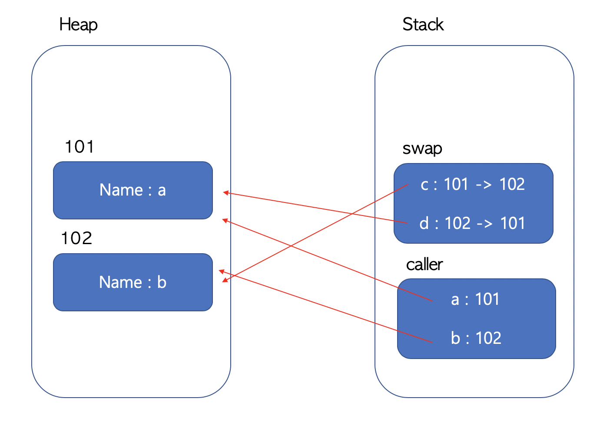
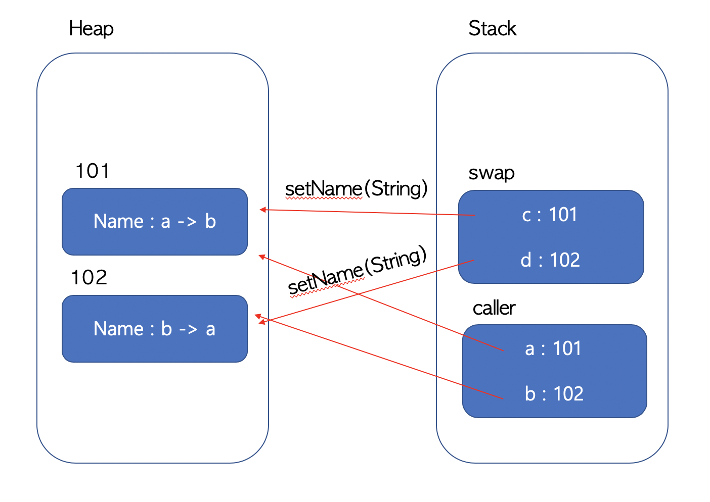

# Java는 Call by Value이다

## java는 Call by Value 인가 Call by reference인가?

정답부터 말하자면 call by value이다. 자바의 자료형에는 원시형과 참조형이 있고 두 자료형에 따라 보여지는 것이 달라 헷갈릴 수 있지만, 결론은 call by value이다.


## caller와 callee

Call by value와 Call by reference의 구별이 필요한 경우는 메소드 호출이다. 메소드를 호출한데 매개변수(parameter)를 설정할 수 있다. 이때 메소들를 호출하는 부분을 caller, 매소드 내부를 callee라고 한다면 매개변수가 값 그자체인지 아니면 주소 값인지를 구별하는 것이 Call by value인지 Call by reference인지를 구별하게 된다.

Call by value의 경우 callee에 값만 전달되기 때문에 caller에 변수에 여향을 미치지 않는다. Call by reference의 경우 객체 자체를 전달하기 때문에 callee에 넘어온 매개변수를 변경하게 되면 영향을 미치게 된다.

```java
class CollerTest {
  
  void caller(){
    int a = 1;
    int b = 2;
    swap(a, b);
    
    system.out.print(a + " " + b);
  }
  
  void swap(int c, int d){
    int temp = c;
    c = d;
    d = c;
  }
  
}
```

위의 코드에서 caller에서 메소드 swap를 부르고 있으니 swap메소드는 callee가 되고 callee안에서 매개변수로 넘어온 변수 a, b의 값을 서로 교환하고 있다.


## 원시타입과 참조타입에 따른 call by value

위 코드에서 print의 결과 값은 `1 2`이다. swap함수의 변수로 복사된 값이 전달 되었기 때문에 caller의 변수에는 영향을 미치지 않는다. 자바에서 값과 참조의 차이를 이해하는 사람이라면 당연하게 여겨질 것이다.

```java
class CollerTest {

  void caller(){
    People a = new People("a");
    People b = new People("b");
    swap(a, b);
		system.out.print(a.name + " " + b.name);
  }

  void swap(People c, People d){
    People temp = c;
    c = d;
    d = c;
  }
}

class People{
  String name;
  People(String a){
    name = name;
  }
}
```

다음 코드는 처음 코드와 같지만 swap의 매개변수가 참조타입으로 바뀌었다. 결과는 마찬가지로 `a b`가 나올 것이다. swap안에서 매개변수를 바꾸는 코드가 있지만 caller에는 영향을 미치지 않는다. 즉 참조타입도 Call by value이다. 만약 call by reference라면 swap 내부의 지역변수 c, d가 객체 자체이기 때문에 caller의 a,b에 영향을 주어야 한다.


## 참조타입의 변수 값은 주소 값이다.

swap(People c, People d) 함수의 c, d의 값은 객체 자체가 아니라 참조타입의 변수 값인 주소값이다. 매개변수로 넘어가는 값이 주소 값이라는 뜻이다. 



위의 그림은 JVM의 메모리 영역이다. swap() 함수 내부에서 지역변수인 c, d는 주소값을 받게 되어 각각 주소값 101, 102의 값을 가리키게 되지만, 안에서  두 변수를 교환하는 코드가 진행된다하더라도, 함수가 끝이나면 지역변수인 c,d는 사라지게 된다. 그래서 caller의 변수 a,b에는 아무런 영향을 미치지 못하게 된다.


## 착각하게 된 이유

위의 그림에서 자바가 Call by reference라면 swap의 지역변수 c,d를 수정해서 caller의 지역변수 a, b가 변경되도록 하는 방법이 있어야 한다. 자바의 객체의 경우 객체의 함수를 통해서 객체의 상태를 변화 시킬 수 있다. 

```java
class CollerTest {

  void caller(){
    People a = new People("a");
    People b = new People("b");
    swap(a, b);
		system.out.print(a.name + " " + b.name);
  }

  void swap(People c, People d){
    c.setName(b);
    d.setName(a);
  }
}

class People{
  String name;
  People(String a){
    name = name;
  }
  
  setName(String a){
    name = a;
  }
}
```

위의 코드상에서 출력은 `b a`이다. 마치 callee의 코드가 caller의 변수에 영향을 미친것 같지만, 객체 자체에 영향을 미쳤다기 보다는 객체의 상태의 변화를 주었다는 것이다. 자바 JVM의 메모리 그림을 다시 보도록 하자



People의 멤버 메소드인 setName을 통해서 101, 102주소에 해당하는 객체의 상태를 변화 시켰다. 그렇다고 해서 swap 메소드가 a, b가 가리키고 있는 101, 102객체를 다른 객체로 변화시킨 것은 아니다. 즉 callee의 코드가 caller의 코드를 변화시킨것은 아니다. 위와 같은 특징 때문에 자바의 객체타입이 call by reference라고 착각할 수 있다.