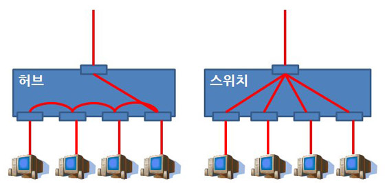
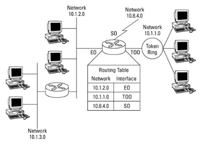
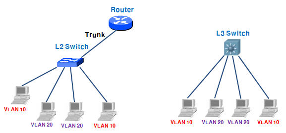
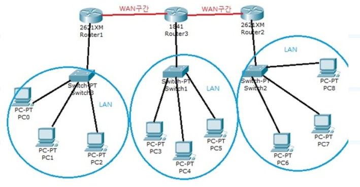
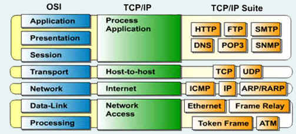

# 네트워크 7계층

네트워크 7계층 정리

[http://blog.naver.com/PostView.nhn?blogId=demonicws&logNo=40117378644](http://blog.naver.com/PostView.nhn?blogId=demonicws&logNo=40117378644)

## 첫번째 : **물리계층 (Physical Layer)**

**통신 케이블로 전기적 신호를 전송한다.**

즉 비트, 1/0의 인코딩 전압등을 정의한 계층이다. 단지 데이터 전달의 역할을 한다.(알고리즘이나 오류제어의 기능이 없음) 1계층의 장비로는 케이블, 허브, 리피터(중계기) 등이 있다.

**리피터**

물리계층은 데이터의 목적지와 발신지를 알 수 없다. 따라서 충돌의 문제가 생기고 이 문제를 해결하기위해 Mac주소를 바탕으로 필터링을 하는 기능을 2계층에서 제공한다.

## 두번째 : 데이터 링크 계층(Data Link Layer)

**물리적인 연결을 통해 인접한 두 장치간 신뢰성 있는 정보전송을 담당함.**

정보의 오류와 흐름을 관리해서 안정된 정보를 전달한다. 프레임(Frame)은 2계층에서의 전송단위로, 주소와 제어정보를 가지고 있다. 2계층의 장비로는 브리지, 스위치가 있다.

2계층 장비인 `스위치(L2:Layer 2 Switch)`는 허브(1계층 장비) 처럼 다른 모든 컴퓨터에 데이터를 전송하지 않고, 필요한 컴퓨터에만 전송한다. 이 기능을 수행하기 위해 스위치는 각 컴퓨터의 고유한 MAC주소 테이블을 학습해야한다.

허브 : 리피터에 여러개 포트를 장착한 것. 

1계층 허브와 달리, Mac주소 테이블을 가진 스위치 스위치는 데이터를 보낼곳과 보내지 않아야 할 곳을 구분 하므로 충돌 도메인을 해결 할 수 있다. 

하지만 네트워크 간의 도메인 충돌은 해결하지 못했으므로, 다른 네트워크에서 온 세그먼트를 구분하지 못한다. 따라서 네트워크를 나누지는 못한다.

## 세번째 : 네트워크 계층(Network Layer)

~~중계 노드를 통해서 전송하는 경우 어떻게 중계할 것인가를 규정한다.~~

**서로 분리된 네트워크 사이에서 패킷 전송을 한다.**

3계층 전송단위인 패킷을 통해 목적지까지 경로 설정을 한다. 이때 데이터를 목적지까지 빠르게 전달하는 일을 라우팅 이라고 한다. IP(Addressing, Fragmentation, Routing)이 이 계층에 해당한다. 3계층 장비로는 라우터, L3(Layer 3) 스위치가 있다.

**라우터 예시**

3계층 장비인 라우터는 1,2계층의 기능(물리 계층 장치처럼 신호를 받아 재생하고, 데이터 링크 계층 장치처럼 패킷이 포함한 물리주소(발신지, 목적지)를 검사할 뿐만 아니라, 네트워크 계층 주소인 IP주소를 검사한다.

`라우터는 분리된 네트워크를 연결 할 수 있다.` 즉 LAN, WAN을 서로 연결 할 수 있고 이렇게 연결된 네트워크를 인터넷 이라고 한다. 서로 분리된 네트워크 사이에서 패킷 전송을 하는데, 이는 라우팅 테이블을 통해 패킷 경로를 지정함으로써 가능하다.

**L3(Layer 3) 스위치**

라우터의 기능을 내장한 스위치. 2계층의 스위칭과 3계층의 라우팅을 할 수 있는 장비이다.

왼쪽 그림처럼 스위치와 라우터를 이용해서 구축해야 하는 네트워크를, 오른쪽처럼 L3 스위치 하나만으로 구축 할 수 있다.

- L4 Switch : OSI 7계층의 4계층을 확인하고, 각 서버들의 부하분산을 위한 로드 벨런싱을 수행한다.
포트 번호를 이용해서, 트래픽을 분산 처리하는것 이며, 4계층에서 발생하는 세션을 관리한다.

**LAN , WAN ?**

https://ledgku.tistory.com/17, https://ironmask.net/357

**LAN (Local Area Network)**

LAN은 사용자가 포함된 지역 네트워크의 범위이다. 

1. 연결장비로 LAN장비(랜카드, L2 스위치) 을 사용한다.

2. Ethernet (데이터 링크 계층중 하나인 IEEE에서 지정한 LAN구간 표준 프로토콜)이라는 프로토콜을 통해 통신한다. 

3. 이때 통신주소는 Mac-address를 사용한다.

**WAN (Wide Area Network)**

큰 범위로 구성되며, 자신이 포함되지 않은 외부 네트워크 구간을 구성한다.(분리된 LAN과 LAN 연결하는 네트워크)

1. WAN장비인 라우터를 통해 연결
2. IP(Internet Protocol)을 프로토콜로 사용한다.
3. 통신주소로 IP adderss를 사용한다.

ISP(Internet Service Provider)에서 관리하고, 서비스를 임대하는 방식으로 제공한다. 이때 WAN경로 구축에는 두가지 기술 방안이 있다. **Circuit Switching(회선 교환 방식)과 Packet Switching(패킷 교환 방식)**

## 전송계층(Transport Layer)

종단 간(End to End)에 신뢰성 있고 정확한 데이터 전송을 담당한다.

4계층에서 세그먼트(Segment)라는 전송단위를 사용하고, 종단간 에러복구와 흐름제어를 담당한다.

예로 TCP, UDP라는 프로토콜이 있다.

## 세션 계층(Session Layer)

통신장치 간 상호작용 및 동기화를 제공한다.

연결 세선 내의 데이터 교환과 에러 발생시 감지와 복구를 수행한다.

## 표현계층(Presentation Layer)

데이터를 표현하는 계층

전송하는 데이터의 인코딩, 디코딩, 암호화 등을 수행한다

예로 ASCII, JPEG등이 있다.

## 응용계층(Application Layer)

응용 프로세스 간의 정보 교환...

# TCP/IP 4계층(Internet)

인터넷 모델이라고 불리는 TCP/IP 4계층을 정리한다.

## 4계층 : 응용계층

TCP/IP기반의 응용프로그램을 구분 할 때 사용된다.

## 3계층 : 전송 계층

통신 노드 간의 연결을 제어한다.

## 2계층 : 인터넷 계층

통신 노드 간의 IP 패킷을 전송하는 기능 및 라우팅 가능을 담당한다.

## 1계층 : 네트워크 인터페이스 계층

패킷망, MAC, LAN, 다이얼 업 모뎀 등 전송에 사용된다.